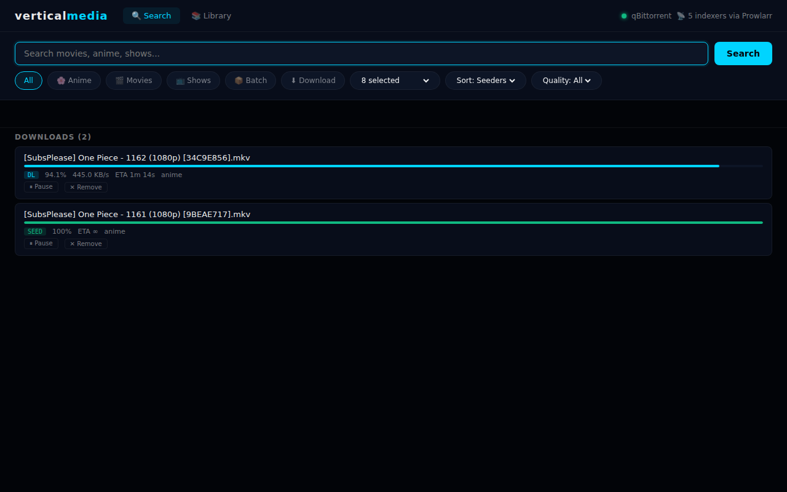

<div align="center">

# verticalmedia

**Self-hosted torrent search and download manager**

Search anime, movies and shows across multiple sources.  
Send directly to qBittorrent. No fuss.

[](https://python.org)
[](https://fastapi.tiangolo.com)
[](LICENSE)
[](docker-compose.yml)



</div>

---

## Features

- **Multi-source search** — Nyaa, PirateBay, AnimeTosho, YTS, Knaben, EZTV, SolidTorrents, Prowlarr
- **TMDB enrichment** — Movie posters and ratings automatically fetched
- **Batch downloads** — Download entire seasons in one click
- **Library management** — View, pause, resume, delete torrents
- **5 themes** — Dark, Catppuccin Mocha, Dracula, Nord, AMOLED
- **Settings UI** — Configure everything without touching files
- **Docker ready** — One command to run
- **Cross-platform** — Linux, Windows, macOS, Docker

---

## Quick Start

### Option 1 — Linux (one command)
```bash
curl -sSL https://raw.githubusercontent.com/PreFounded/verticalmedia/main/install.sh | bash
```

### Option 2 — Windows (PowerShell)
```powershell
irm https://raw.githubusercontent.com/PreFounded/verticalmedia/main/install.ps1 | iex
```

Requires [Python 3.10+](https://python.org/downloads/) and [Git](https://git-scm.com) to be installed first.  
Optionally installs as a Windows service via [NSSM](https://nssm.cc) — or generates a `run.bat` if NSSM isn't present.

### Option 3 — Docker
```bash
docker run -d \
  -p 7171:7171 \
  -e QBIT_URL=http://your-server:8081 \
  -e QBIT_USERNAME=admin \
  -e QBIT_PASSWORD=adminadmin \
  ghcr.io/prefounded/verticalmedia:latest
```

### Option 4 — Docker Compose
```bash
git clone https://github.com/PreFounded/verticalmedia
cd verticalmedia
# Edit docker-compose.yml with your qBittorrent details
docker compose up -d
```

### Option 5 — Manual
```bash
git clone https://github.com/PreFounded/verticalmedia
cd verticalmedia
pip install -r requirements.txt
cp .env.example .env
# Edit .env with your settings
python -m uvicorn main:app --host 0.0.0.0 --port 7171
```

Open `http://localhost:7171` in your browser.

---

## Requirements

| Requirement | Details |
|-------------|---------|
| Python | 3.10 or higher |
| qBittorrent | Any version with Web UI enabled |
| Prowlarr | Optional — enables extended indexer support |

---

## Configuration

Copy `.env.example` to `.env` and edit:

```env
# qBittorrent (required)
QBIT_URL=http://localhost:8081
QBIT_USERNAME=admin
QBIT_PASSWORD=adminadmin

# Prowlarr (optional)
PROWLARR_URL=http://localhost:9696
PROWLARR_KEY=your_api_key_here

# Download paths
PATH_ANIME=/downloads/anime
PATH_MOVIES=/downloads/movies
PATH_SHOWS=/downloads/shows
```

You can also configure everything via the settings panel in the web UI (⚙ icon top-right).

---

## Sources

| Source | Type | Category |
|--------|------|----------|
| Nyaa.si | Scraper | Anime |
| AnimeTosho | API | Anime |
| PirateBay | API | General |
| YTS | API | Movies |
| Knaben | Scraper | General |
| EZTV | API | TV Shows |
| SolidTorrents | API | General |
| Prowlarr | API | All (your configured indexers) |

---

## Themes

Switch themes via Settings (⚙) → Theme:

| Theme | Style |
|-------|-------|
| **Dark** | Navy background, cyan accent |
| **Catppuccin Mocha** | Purple/peach, warm dark |
| **Dracula** | Classic purple/pink |
| **Nord** | Arctic blue, clean |
| **AMOLED** | Pure black, green accent |

---

## API

Full docs at `http://localhost:7171/docs`.

```
GET  /api/search?q=one+piece&category=anime&sources=nyaa
POST /api/download          body: {magnet, category}
POST /api/batch-download    body: {name, ep_start, ep_end, ...}
GET  /api/library           all qBittorrent torrents
DELETE /api/torrent/{hash}  remove torrent
GET  /api/config            current configuration
GET  /health                health check
```

---

## Project Structure

```
verticalmedia/
├── main.py              # FastAPI app + routes
├── config.py            # Configuration (env vars)
├── scrapers/
│   ├── nyaa.py
│   ├── piratebay.py
│   ├── animetosho.py
│   ├── yts.py
│   ├── knaben.py
│   ├── eztv.py
│   ├── solidtorrents.py
│   ├── prowlarr.py
│   ├── batch_downloader.py
│   └── utils.py
├── static/
│   ├── index.html       # Full frontend (single file)
│   └── themes/          # CSS themes
├── docs/
├── install.sh           # Linux/macOS installer
├── install.ps1          # Windows installer
├── docker-compose.yml
└── Dockerfile
```

### Adding a Scraper

Create `scrapers/mysource.py`:

```python
import httpx
from .utils import detect_quality

async def scrape(query: str, client: httpx.AsyncClient,
                 timeout: int = 15, **kwargs) -> list:
    results = []
    # Your scraping logic here
    return results
```

Then add to the relevant section in `main.py`'s search route.

---

## Contributing

1. Fork the repo
2. Create a branch (`git checkout -b feature/new-scraper`)
3. Make changes and test locally
4. Submit a PR

Ideas:
- New scrapers (AniDex, TorrentGalaxy)
- New themes
- Better mobile UI
- Subtitle download integration

---

## License

MIT — do whatever you want with it.

---

<div align="center">
Built by <a href="https://github.com/PreFounded">Vertical</a>
</div>
